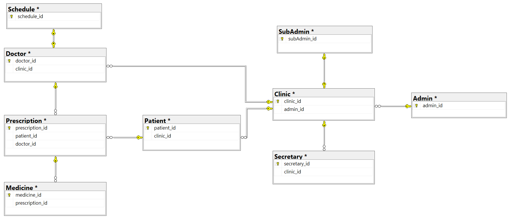

# Eclinic

## What is Eclinic? 

It is a website that designed for anyone building a small clinic service, to make easier for the doctor write prescriptions, and store patients data. Also to help secretaries in registering new patients and viewing patients records.

 
 

 
 

## How to use it? 

As a person who wants to create his own clinic needs to follow those instructions : 

 

  1- Register as the owner.

  2- Create the clinic by filling the required form. 

  3- The request of creation will be pending until the admin accept it. 
  
   

  **After accepting the clinic :**

  1- The owner can add doctors and secretaries.

  * **As a secretary :** 

    1- I can add new patients, edit and delete any.

	2- Refer to the doctors and their patients.

  * **As a doctor :** 

    1- I can add a new prescription for each patient.

	2- View the records of my patients.

 
 

 
 

## Technologies :

  - Spring boot.

  - Gradle.

  - JQuery.

  - Bootstrap.

 
 

 
 

## DATABASE :

   - **ERD :**
   
    
   
   
    

    
